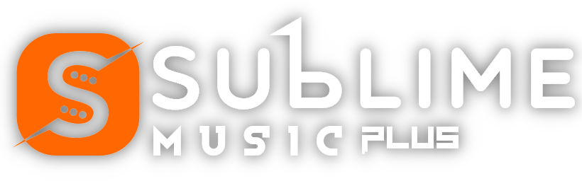
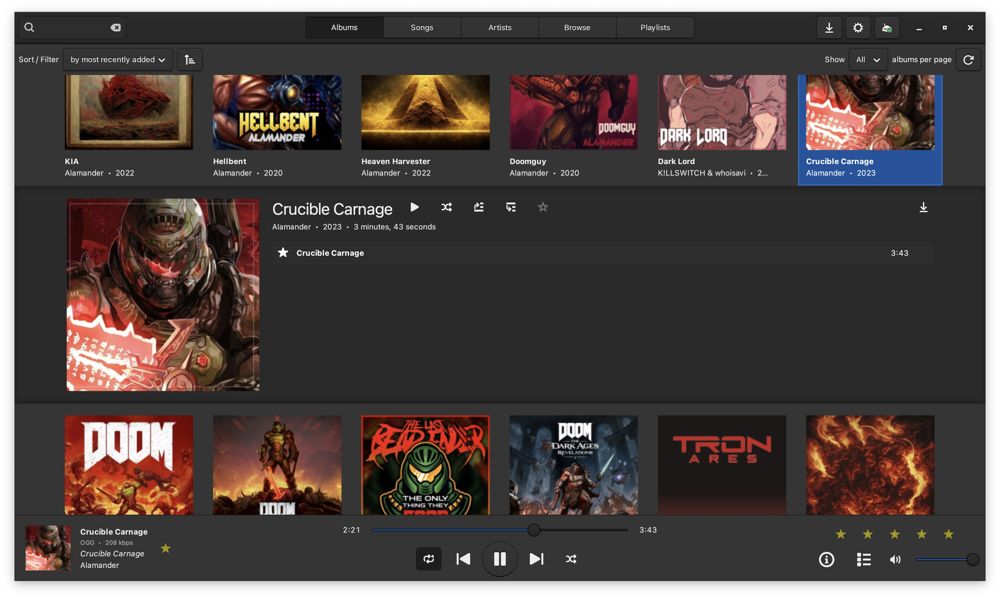

# Sublime Music (Plus)



Sublime Music is a native, GTK3, Subsonic client for the Linux Desktop.

> Sublime Music has reached End of Maintanance for quiet a while already (See original [Maintainers Post](http://sumnerevans.com/posts/projects/sublime-music-eom)).
>
> This fork tries to remedy some of the issues that derived from that aswell as trying to add some additional features ;) All changes were only tested using my Gonic OpenSubsonic Server 
> Should also work with Navidrome and others (if they dont return all songs on empty search3 string they might be a bit slower though)
---

[](docs/_static/screenshots/play-queue.png)

The Albums tab of Sublime Music with the Play Queue opened.

## Features and Optimizations

### New Features :

- The Songs tab: the whole library in one sortable, filterable table.
- Clear Cue Button in Cue
- Cue Replacement Warnings
- Keyboard media key grabber so your browser doesnt steal media keys from you (on GNOME based stuff and MacOS, rest can still be stolen by your browser unfortunately)

### Improvements and Bugfixes :

- Better/Fixed Caching
- Playlists not loading fixed
- God knows how many other issues I stoped counting
- Bugfixes on things I broke myself or that felt off.
- Many many performance related fixes and improvements.


### Existing Features

- Switch between multiple Subsonic API (v1.8.0+) compliant servers.
- Play music through Chromecast devices on the same LAN.
- Offline Mode where Sublime Music will not make any network requests.
- Browse songs by the sever reported filesystem structure, or view them organized by ID3 tags in the Albums, Artists, and Playlists views.
- Intuitive play queue.
- Create/delete/edit playlists.
- Download songs for offline listening.

### Removed Features

- ci/cd (didnt feel like it)

## Installation

Sublime Music (Plus) is built and installed with the `Makefile` in the repository root.
You need `python3` (3.10 or newer), `pip`, GNU make and at runtime GTK3 with PyGObject and libmpv

To get those on Debian/Ubuntu:

`sudo apt install python3 python3-pip python3-gi python3-gi-cairo gir1.2-gtk-3.0 gir1.2-notify-0.7 libmpv2`

### Debian package (recommended)

```
make deb
sudo apt install ./dist/sublime-music_*_bundled.deb
```

Three flavours, chosen with `BUNDLE=`:

| `make deb BUNDLE=`          | what is inside the package                                                                        | size (installed) |
|-----------------------------|---------------------------------------------------------------------------------------------------|------------------|
| `2`, *full*                 | everything: tossed in the deb file, only glibc, X11 and OpenGL come from the system (stupid dont) | 110 MB (320 MB)  |
| `1`, *bundled*, **default** | The Python dependencies are bundled, PyGObject/GTK and libmpv come from Debian's packages         | 8 MB (42 MB)     |
| `0`, *thin*                 | only the app, rest via APT repos                                                                  | 0.2 MB (1.5 MB)  |

Full package shouldnt be used unless you really need to for whatever reason (like me trying to run it on a hacked embedded linux appliance where i cant change the actuall root partitions files)
The bundled and full packages are obviously tied to the machine's architecture the thin one to what your package manager has to offer.

### Without a package

```
make stage            # as your user, so build/ stays yours
sudo make install     # copies the staged tree under /usr/local
sudo make uninstall   # removes it again
```

`PREFIX=...` changes the location and `BUNDLE=` picks the flavour, for both.

### Running from the source tree

```
make run                    # same as PYTHONPATH=. python3 -m sublime_music
make run ARGS="-m debug"    # with debug logging
```

### macOS
You probably dont want to actually use this on MacOS tbh, stability is a bit meh meh especially mpv wise. If you really have to heres how to :

You'll need this based on your System Architecture :

aarch64 : 
```
xcode-select --install
brew install python@3 pygobject3 gtk+3 gobject-introspection adwaita-icon-theme librsvg mpv fontconfig
make pkg
```

x86-64 :
```
xcode-select --install
sudo port install python313 py313-pip py313-gobject3 gtk3 gobject-introspection adwaita-icon-theme librsvg mpv fontconfig
```

`make pkg` on a Mac builds a self contained `Sublime Music.app` (Python, GTK, PyGObject, libmpv and all Python dependencies inside, built with PyInstaller) and wraps it in `dist/SublimeMusic-<version>-bundled.pkg`, which installs it into `/Applications`.

Homebrew/MacPorts is needed to build it, not to run it in theory.

If you use `make pkg BUNDLE=0` it builds a thin app that uses the Homebrew/MacPorts Python and GTK instead of bundling it in.

### Change of Build system/Method

Upstream built with flit and pip-tools, published to PyPI through GitHub Actions and shipped a Nix flake.

The fork is built by the root `Makefile` described above.
`pyproject.toml` still declares the metadata and dependencies (so `pip install .` keeps working), while the pip-tools lock files.
The pre-commit config, the Nix flake and the GitHub workflows were removed. The Sphinx docs in `docs/` can still be built locally with

I know the makefile stuff looks like a mess and it partially is but it helped me run Sublime music on an arm64 based Linux Cash Register that I use as a Music Hub now.

### Code
Because of my "cant write code in tabbed language" disability, which stems from having the "i write ugly but functional code" syndrome (rust fmt my beloved thanks for existing), most of the code changes and comments were heavily assisted by LLMs.

Code has been inspected as best as I can with my rust/php coding skills, tests only inspected briefly, comments might be a bit slop aswell as in docs that were updated by them without asking.

## Motivations, Credits and Thank You's

All credits to previous maintainer, this app is a true banger thats truly irreplacable to me, especially since its not plagued by one of these problems alternatives come with :
- Literally being a Web-App that doesnt integrate into my Desktop Theme at all
- Using an UI Framework that doesnt seem to like any sort of none Wayland Scaling